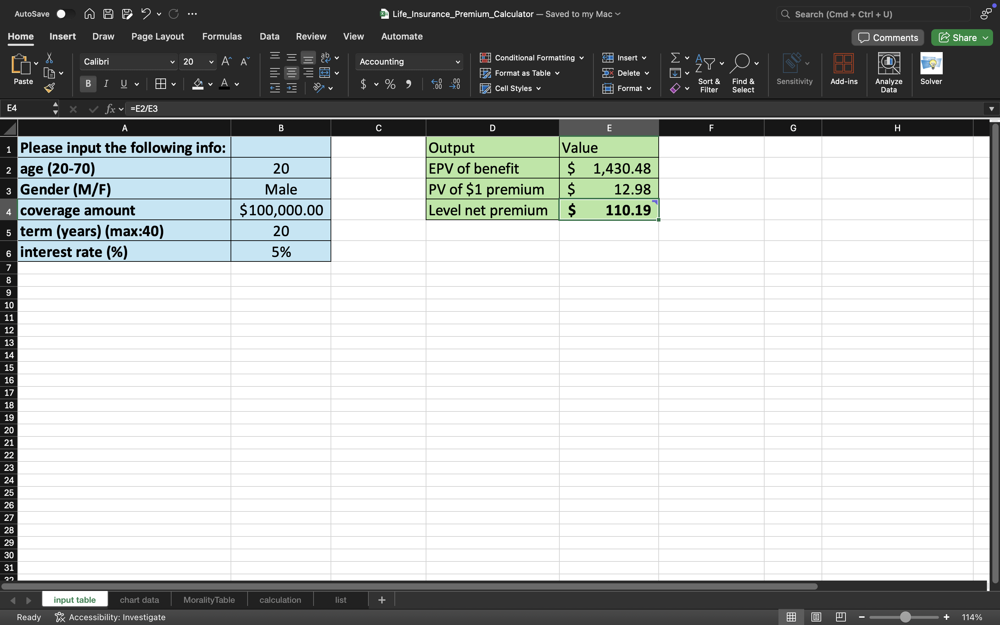
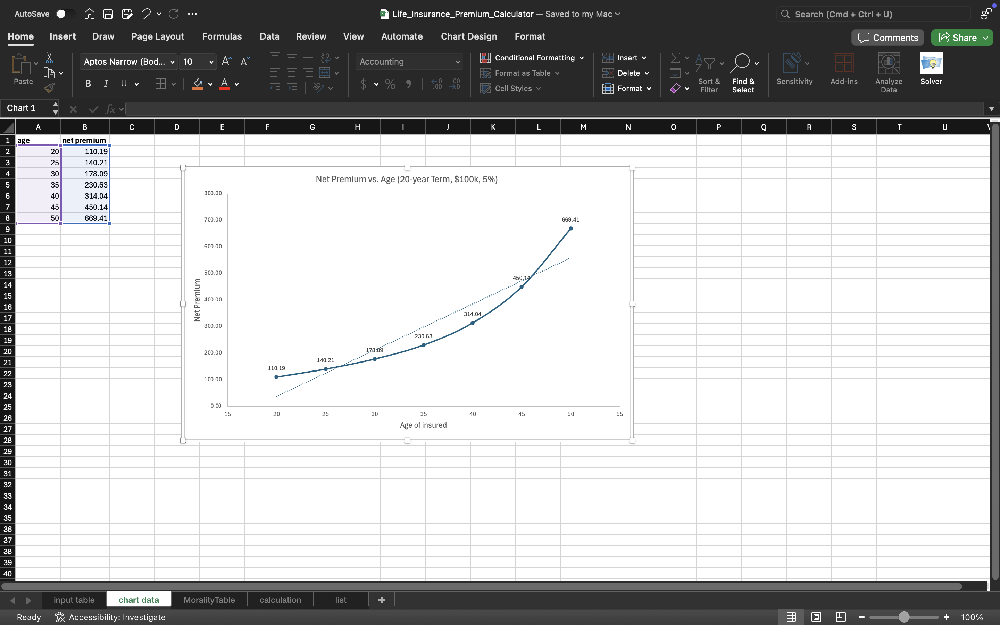

# 📊 Life Insurance Premium Calculator (Excel)

## 🔹 Overview
A simplified actuarial model in Excel to calculate **net level premiums** for a term life policy.  
Built using Statistics Canada mortality data and standard actuarial formulas for survival, death probabilities, and discounting.  

---

## 🛠 Features
- 📥 **Inputs**: Age, Gender, Coverage, Term, Interest Rate  
- 🧮 **Engine**: Calculates survival & death probabilities, EPVs, and net premiums  
- 📈 **Dashboard**: Chart of **Net Premium vs. Age** showing how premiums rise with age  

---

## 📂 Structure
- **Dashboard** – Input box, outputs, and chart  
- **MortalityTable** – qx values (ages 20–70, Male/Female)  
- **Calculation** – Backend formulas (EPV, premium weights)  

---

## 🔑 Example Output
- Age 20 → ~$110  
- Age 30 → ~$178  
- Age 50 → ~$669  

Premiums rise **exponentially** with age due to higher mortality risk.  

---
## 📸 Screenshots
### Dashboard  
  

### Net Premium vs Age  

---

## 🎯 Skills
- Excel modeling & data tables  
- Actuarial pricing concepts (mortality, EPV, net premiums)  
- Data visualization & dashboard design  
